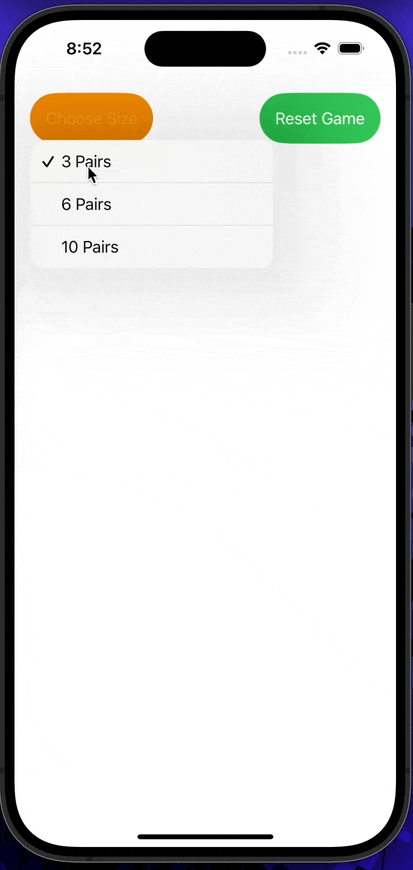

## IOS102 Project 4: Answer Key

### Overview

Students will create their own version of a memory game. The app will follows some simple rules that will be described in the required and optional features.

Rules of the main:

1. User can flip two cards up at once. 
2. If the cards flipped match, they are removed.
3. If the cards do not match, they go back to being faced down.
4. The game ends when all cards are removed from the view.

Dev Note: V3 of the game is the working version. The earlier versions are either incomplete or not working at all. Yes, I do see the irony of seeing multiple versions on GitHub...
